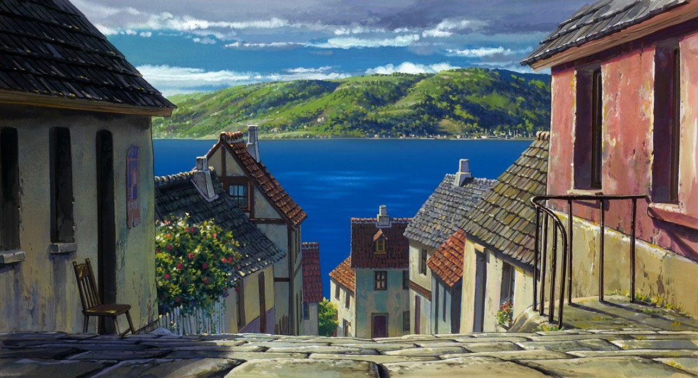

---
light-theme: false
dimensions:
    page-height: 66
    body-width: 70
    notes-width: 20
    separation: 4
    indentations: 0
    margins:
        top: 2
        bottom: 2
        inside: 10
        outside: 5
...

# RGB

## Half-blocks {subtitle="Uses “ ▄ ”"}

{palette=RGB mode=Pixels}

{palette=RGB mode=Pixels}

## Blocks {subtitle="Uses “ █ ”"}

{palette=RGB mode=Blocks}

{palette=RGB mode=Blocks}

# xterm-256

## Half-blocks {subtitle="Uses “ ▄ ”"}

{palette=Xterm mode=Pixels}

{palette=Xterm mode=Pixels}

## Dithered {subtitle="Uses “ ░ ▒ ▓ █ ”"}

{palette=Xterm mode=Dithered}

{palette=Xterm mode=Dithered}

## Blocks {subtitle="Uses “ █ ”"}

{palette=Xterm mode=Blocks}

{palette=Xterm mode=Blocks}

# ANSI

## Half-blocks {subtitle="Uses “ ▄ ”"}

{palette=ANSI mode=Pixels}

{palette=ANSI mode=Pixels}

## Dithered {subtitle="Uses “ ░ ▒ ▓ █ ”"}

{palette=ANSI mode=Dithered}

{palette=ANSI mode=Dithered}

## Blocks {subtitle="Uses “ █ ”"}

{palette=ANSI mode=Blocks}

{palette=ANSI mode=Blocks}

# Monochrome

## Half-blocks {subtitle="Uses “ ▄ ”"}

{palette=Monochrome mode=Pixels}

{palette=Monochrome mode=Pixels}

## Dithered {subtitle="Uses “ ░ ▒ ▓ █ ”"}

{palette=Monochrome mode=Dithered}

{palette=Monochrome mode=Dithered}

## Blocks {subtitle="Uses “ █ ”"}

{palette=Monochrome mode=Blocks}

{palette=Monochrome mode=Blocks}
